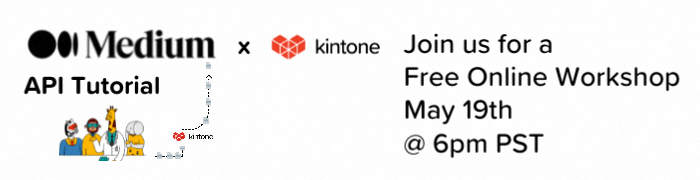

# Publish Directly to Medium.com with [Kintone Web Database](https://kintone.dev)



Thank you for attending our **Kintone x Medium** workshop!  
Check out [meetup.com/Kintone-Developers](https://www.meetup.com/Kintone-Developers/) to check out all of our upcoming events!

## Outline <!-- omit in toc --> <!-- markdownlint-disable MD007 -->

* [Get Started](#get-started)
* [Overview of the Repo](#overview-of-the-repo)
* [Kintone Web Database & Credentials](#kintone-web-database--credentials)
  * [🚀 Getting your FREE Kintone Database](#-getting-your-free-kintone-database)
* [Create a Kintone Web Database App](#create-a-kintone-web-database-app)
* [Create a `.env` file](#create-a-env-file)
* [Input the App ID](#input-the-app-id)
* [Build the customization](#build-the-customization)
* [Debugging - Let's Fix Those Problems 💪](#debugging---lets-fix-those-problems-)
  * [Errors related to .env](#errors-related-to-env)
  * [`npm install` command is not working](#npm-install-command-is-not-working)
  * ["npm run upload" failed?](#npm-run-upload-failed)

<!-- markdownlint-enable MD007 -->

## Get Started

First, let's clone the [sean-kintone/publish-to-medium](https://github.com/sean-kintone/publish-to-medium) repo and go inside the folder.

Once you are inside the folder, let's install the dependencies!

```shell
cd Downloads

git clone https://github.com/sean-kintone/publish-to-medium

cd publish-to-medium

npm install

npm install -g @kintone/customize-uploader
```

## Overview of the Repo

| File                                                         | Purpose                                                                      | Need to Modify?        |
| ------------------------------------------------------------ | ---------------------------------------------------------------------------- | ---------------------- |
| [package.json](package.json)                                 | Project's metadata & scripts for building and uploading the customization    | _Nope_                 |
| [webpack.config.js](webpack.config.js)                       | Holds the Webpack's configuration for the react project                      | _Nope_                 |
|                                                              |                                                                              |                        |
| [.env.example](.env.example)                                 | The template for the .env file                                               | _Nope_                 |
| [.env](.env)                                                 | Holds the Kintone login credential and View ID                               | Yes! - Code it         |
|                                                              |                                                                              |                        |
| [scripts/npm-start.js](scripts/npm-start.js)                 | Script that uses `npm-run-all` to run `build` & `upload` scripts in parallel | _Nope_                 |
| [customize-manifest.json](customize-manifest.json)           | Kintone Customize Uploader's configuration file                              | Yes! - Add your App ID |
| [dist/KintoneCustomization.js](dist/KintoneCustomization.js) | The bundled JS build that will be uploaded to Kintone                        | _Nope_                 |
|                                                              |                                                                              |                        |
| [src/main.ts](src/main.ts)                                   | Heart of the project handling `<App />` and Kintone Events                   | Yes! Code it           |
| [src/index.html](src/index.html)                             | HTML from which our vite app gets called from.                               | _Nope_                 |
| [src/index.css](src/index.css)                               | Styling for the project can go here                                            | _Nope_                 |
| [src/requests/post_api.ts](src/requests/post_api.ts)         | The logic of the Medium.com POST API call                                    | _Nope_                 |
|                                                              |                                                                              |                        |
| [fields.d.ts](fields.d.ts)                                     | Various type definitions for our typescript / Kintone environment                                           | _Nope_                 |
| [tsconfig.json](tsconfig.json)                                     | Various settings for how typescript behaves                            | _Nope_                 |
| [vite.config.js](vite.config.js)                                     | Various settings for how and where our typescript compiles to                 | _Nope_                |
| [slides.pdf](slides.pdf)                                     | Workshop presentation's slide deck                                           |                        |

---

## Kintone Web Database & Credentials

### 🚀 Getting your FREE Kintone Database

* [bit.ly/KDP_NEW](http://bit.ly/KDP_NEW)
* ⚡ Only use lowercase, numbers, & hyphens in your subdomain
* ⚠ Do not use uppercase nor special characters


---

## Create a Kintone Web Database App

Let's create a Kintone App with an article title, and text to send to Medium!


Kintone makes it easy to setup a web database with API routes for getting information. The .gif above is one minute in length!

Here are the required fields & their configurations for our workshop:

| Field Type | Field Name | Field Code        | Note                                    |
| ---------- | ---------- | ----------------- | --------------------------------------- |
| Blank Space|    ---     | `publishToMedium` | This is where our button will attach    |
| Text       | Title      | `title`           | The title of our medium.com article     |
| Text Area  | Body       | `body`            | The body text of our medium.com article |

Be sure to click the **Save** and **Activate App** buttons! 💪

Confused? 🤔 → Check out the [How to Create a Kintone Database App](https://youtu.be/pRtfn-8cf_I) video 📺

### 📺 How to Create a Kintone Database App | Video <!-- omit in toc -->

<p align="center">
  <a href="https://youtu.be/pRtfn-8cf_I">
    
  </a>
</p>

---

## Create a `.env` file

Using the [.env.example](.env.example) file as a temple, create a `.env` file that will contain your login credentials and the Kintone App's View ID.

Here is what your `.env` might look like:

```txt
KINTONE_BASE_URL="https://example.kintone.com"
KINTONE_USERNAME="example@gmail.com"
KINTONE_PASSWORD="ILoveKintone!"
VITE_AUTHOR_ID="12345abcde67890"
VITE_API_TOKEN="09876edcba54321"
```

⚠️ DO NOT DELETE THE [.env.example](.env.example) FILE!  
[.env.example](.env.example) is used by env-cmd to verify that `.env` file is correctly configured.

---

## Input the App ID

The Kintone Customize Uploader uses [customize-manifest.json](customize-manifest.json) to determine where to upload the JavaScript file (_which Kintone App_).

```json
{
    "app": "23",
    "scope": "ALL",
    ...
}
```

So to ensure the file gets uploaded to the correct App, replace the `23` with your App ID.

**What is my App ID?** 🤔  

* Go to your Kintone App & grab the URL
* Kintone App's URL follows this template: `https://<SUBDOMAIN>.kintone.com/k/<App ID>/show#record=<RECORD ID>`
* Grab the number between the `/k/`
* Example: `https://example.kintone.com/k/1/` -> The App's ID is `1`

---

## Build the customization

1. Build the customization in the following files inside `./src/`
   * `main.ts`, `/requests/post_api.ts`, etc.
2. Run `npm run build` to compile your Typescript into Javascript output in the `/dist` folder.
3. Run `npm run upload` to upload the compiled files to your Kintone subdomain.
   * To directly upload the Kintone customization, use `./dist/KintoneCustomization.js`.
   * For more details, refer to [Customizing an App with JavaScript and CSS](https://get.kintone.help/k/en/user/app_settings/js_customize.html)
4. Run `npm run start`
   * This will trigger webpack & kintone-customize-uploader to run while watching `./src/main.ts` for changes
   * Input Kintone credentials if asked
5. Refresh the Kintone App to see the changes!

Good luck coding!

---

## Debugging - Let's Fix Those Problems 💪

Here is a rundown of common problems that may occur & their solutions!

### Errors related to .env

If you get one of the following error messages, then please verify your `.env` file has been correctly configured, and you have not modified the `.env.example`.

* `Failed to find .env file at default paths: [./.env,./.env.js,./.env.json]`
* `[webpack-cli] Error: Missing environment variable: KINTONE_BASE_URL`
* `[webpack-cli] Error: Missing environment variable: KINTONE_USERNAME`
* `[webpack-cli] Error: Missing environment variable: KINTONE_PASSWORD`
* `[webpack-cli] Error: Missing environment variable: VITE_AUTHOR_ID`
* `[webpack-cli] Error: Missing environment variable: VITE_API_TOKEN`

### `npm install` command is not working

1. Verify the Node.js & npm versions **inside** the `publish-to-medium` folder
2. Just installed Node.js? Verify you configured Node.js versions **inside** the `publish-to-medium` folder

* Mac: `nodenv local 14.5.0`
* Windows: `nvm use 14.5.0`

### "npm run upload" failed?

_@kintone/customize-uploader not working?_ Let's try the following:

(1) Verify that customize uploader was installed globally

* `npm install -g @kintone/customize-uploader`

(2) Verify that the .env login info is correct (including the password)

* ⚠️ Make sure your login info is inside `.env` file & **NOT** `.env.example` file!
* ⚠️ Verify that KINTONE_BASE_URL input is correctly formatted:
  * ✅ Correct Format: `https://example.kintone.com`
  * ❌ Incorrect Format: `https://example.kintone.com/` or `example.kintone.com`
* ⚠️ Re-run the npm commands after saving the .env file
* ⚙️ Details: [Create a `.env` file](#create-a-env-file)

(3) Verify your customize-manifest.json was updated with the correct App ID

* ⚙️ Details: [Input the App ID](#input-the-app-id)
