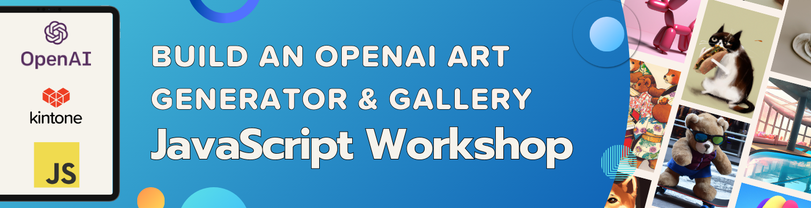
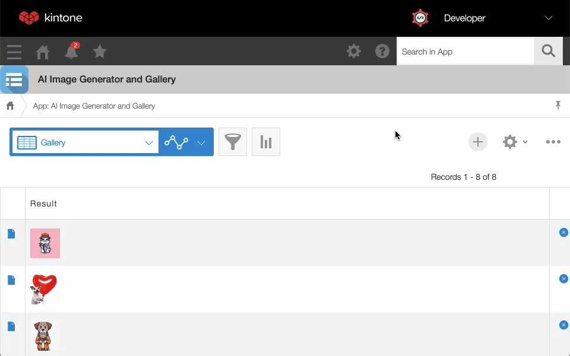

# Build an OpenAI Art Generator & Gallery - JavaScript Workshop

---



Let's create an AI Art Generator using [OpenAI's DALL·E 2](https://openai.com/product/dall-e-2) and a gallery using the [Kintone web database](https://kintone.dev/en/) together!

## Outline <!-- omit in toc -->
* [Completed Project](#completed-project)
* [Get Started](#get-started)
* [Get Your Free Kintone Database](#get-your-free-kintone-database)
* [Workshop Steps](#workshop-steps)
* [Quick Dive into OpenAI's API](#quick-dive-into-openais-api)
  * [What is DALL-E?](#what-is-dall-e)
* [Debugging](#debugging)
  * [Errors related to OpenAI API Keys](#errors-related-to-openai-api-keys)
  * [Errors related to .env](#errors-related-to-env)
  * [Errors related to kintone-customize-uploader](#errors-related-to-kintone-customize-uploader)
    * [kintone-customize-uploader Error 1](#kintone-customize-uploader-error-1)
    * [kintone-customize-uploader Error 2](#kintone-customize-uploader-error-2)
  * [Error when trying to install kintone-customize-uploader](#error-when-trying-to-install-kintone-customize-uploader)
  * [Errors related to Node.js \& npm](#errors-related-to-nodejs--npm)
  * [`npm install` command is not working](#npm-install-command-is-not-working)
  * [`npm run upload` failed?](#npm-run-upload-failed)
  * [Not seeing a highlighted `TODO:`?](#not-seeing-a-highlighted-todo)
* [Completed Code](#completed-code)
* [Overview of the Repo](#overview-of-the-repo)

## Completed Project


## Get Started
_Clone the Repo & Install Dependencies_ 💪

First, clone the [kintone-workshops/ai-kintone-gallery](https://github.com/kintone-workshops/ai-kintone-gallery) repo!  🚀  
Then go inside the folder & install the dependencies!

```shell
cd Downloads

git clone https://github.com/kintone-workshops/ai-kintone-gallery

cd ai-kintone-gallery

npm install

npm install -g @kintone/customize-uploader
```

Open the `ai-kintone-gallery` folder in [VS Code](https://code.visualstudio.com/docs/getstarted/tips-and-tricks#_command-line) as well:

```shell
code .
```

## Get Your Free Kintone Database

[kintone.dev/new/](http://kintone.dev/new/)
* ⚡ Only use lowercase, numbers, & hyphens in your subdomain
* ⚠ Do not use uppercase or special characters

|                                                                                                 |                                                                                                                   |
| ----------------------------------------------------------------------------------------------- | ----------------------------------------------------------------------------------------------------------------- |
|          |  |
|  |                                                               |

For more information, check out the [Workshop_Steps.md > B. Get Your Free Kintone Database](./docs/Workshop_Steps.md#b-get-your-free-kintone-database) section!

---

## Workshop Steps

* [A. Get Started - Clone the Repo \& Install Dependencies](./docs/Workshop_Steps.md#a-get-started---clone-the-repo--install-dependencies)
* [B. Get Your Free Kintone Database](./docs/Workshop_Steps.md#b-get-your-free-kintone-database)
* [C. Create a `.env` file](./docs/Workshop_Steps.md#c-create-a-env-file)
* [D. Create a Kintone Web Database App](./docs/Workshop_Steps.md#d-create-a-kintone-web-database-app)
* [E. Generate an API Token for Kintone App](./docs/Workshop_Steps.md#e-generate-an-api-token-for-kintone-app)
* [F. Edit Your customize-manifest.json](./docs/Workshop_Steps.md#f-edit-your-customize-manifestjson)
* [G. Create an OpenAI API Key](./docs/Workshop_Steps.md#g-create-an-openai-api-key)
* [H. Edit main.js](./docs/Workshop_Steps.md#h-edit-mainjs)
* [I. Compile and upload the code to Kintone](./docs/Workshop_Steps.md#i-compile-and-upload-the-code-to-kintone)
* [J. Add a record to the Kintone App to generate an image](./docs/Workshop_Steps.md#j-add-a-record-to-the-kintone-app-to-generate-an-image)

---

## Quick Dive into OpenAI's API

### What is DALL-E?
OpenAI's AI system that generates images from textual descriptions.  
The [Image generation](https://platform.openai.com/docs/guides/images) APIs are currently released as a public beta.

Based on a Generative Pre-trained Transformer 3 (GPT-3) neural network architecture
* Trained on massive amount of text data (i.e., the Internet)
* Goal is to "comprehend" natural language

DALL-E can generate a wide range of images
* Everything from abstract art to photo-like scenes

3 methods for interacting with images:
* Generating new images based on a text prompt
* Editing an existing image based on a text prompt
* Generating variations based on an existing image

Pricing is per image and varies by resolution:
* 1024×1024 = $0.020
* 512×512 = $0.018
* 256×256 = $0.016

---

## Debugging
**Let's Fix Those Problems** 💪

Here is a rundown of common problems that may occur & their solutions!

### Errors related to OpenAI API Keys

Are you not getting any images even though you have a `.env` file with your OpenAI API Key?

Open console and check for the following error message:
`openai.error.RateLimitError: you exceeded your current quota, please check your plan and billing details`

If you get this error message, then you have exceeded your free trial credits.  
You will need to upgrade to a paid plan to continue using the API.

Check your OpenAI API usage here:  
<https://platform.openai.com/account/usage>

⚠️ Note: OpenAI only gives you free credits for the first account associated with your phone number.  
Subsequent accounts are not granted free credits.

### Errors related to .env

If you get one of the following error messages:  

* `[webpack-cli] Error: Missing environment variable: KINTONE_BASE_URL`
* `[webpack-cli] Error: Missing environment variable: KINTONE_PASSWORD`
* `[webpack-cli] Error: Missing environment variable: KINTONE_USERNAME`
* `[webpack-cli] Error: Missing environment variable: VIEW_ID`
* `[webpack-cli] TypeError: Cannot convert undefined or null to object`
* `Failed to find .env file at default paths: [./.env,./.env.js,./.env.json]`
* `Failed to find .env file at default paths: [./.env,./.env.js,./.env.json]`
* `Failed to upload JavaScript/CSS files`
* `KintoneRestAPIError: [520] [CB_WA01] Password authentication failed...`

Then please verify that
* your `.env` file has been correctly configured
* your username and password for your Kintone account are correct
* you have not modified the `.env.example`

### Errors related to kintone-customize-uploader

#### kintone-customize-uploader Error 1
Error Message:

```shell
Options: {"command":"kintone-customize-uploader","commandArgs":["customize-manifest.json"],"options":{"expandEnvs":false,"noOverride":false,"silent":false,"useShell":false,"verbose":true}}
Found .env file at default path: ./.env
spawn kintone-customize-uploader ENOENT
Parent process exited with signal: 1. Terminating child process...
```

If you get the above error message, please verify that you have installed the `kintone-customize-uploader` package.

Solution:

```shell
npm install -g kintone-customize-uploader
```

#### kintone-customize-uploader Error 2
Error Message:  
`KintoneRestAPIError: [403] [CB_NO02] No privilege to proceed. (YvIvLH6UrE8kqnRjT7Va)`

If you get the above error, the Kintone account you are using to upload the code is not a Kintone Administrator.

Solution:  
Use a Kintone account that has Kintone Administrator privileges. Only Kintone Administrators can upload code to Kintone, regardless of the permissions set for the App.

For detailed steps, checkout this Developer Forum post: <https://forum.kintone.dev/t/766>

### Error when trying to install kintone-customize-uploader

Error:  
* `npm ERR! code EACCES`
* `npm ERR! syscall mkdir`
* `npm ERR! path /usr/local/lib/node_modules/@kintone`
* `npm ERR! errno -13`
* `npm ERR! Error: EACCES: permission denied, mkdir '/usr/local/lib/node_modules/@kintone'`

Solution:

```shell
sudo npm install -g kintone-customize-uploader
```

### Errors related to Node.js & npm

Error Message:

```shell
vite build --emptyOutDir

internal/process/esm_loader.js:74
    internalBinding('errors').triggerUncaughtException(
                              ^

Error [ERR_UNSUPPORTED_ESM_URL_SCHEME]: Only file and data URLs are supported by the default ESM loader. Received protocol 'node:'
    at Loader.defaultResolve [as _resolve] (internal/modules/esm/resolve.js:782:11)
    at Loader.resolve (internal/modules/esm/loader.js:85:40)
    at Loader.getModuleJob (internal/modules/esm/loader.js:229:28)
    at ModuleWrap.<anonymous> (internal/modules/esm/module_job.js:51:40)
    at link (internal/modules/esm/module_job.js:50:36) {
  code: 'ERR_UNSUPPORTED_ESM_URL_SCHEME'
}
```

Solution:

```shell
cd ai-kintone-gallery
npm install
```

### `npm install` command is not working

1. Verify the Node.js & npm versions **inside** the `ai-kintone-gallery` folder
2. Just installed Node.js? Verify you configured Node.js versions **inside** the `ai-kintone-gallery` folder

* Mac: `nodenv local 14.5.0`
* Windows: `nvm use 14.5.0`

Not the correct versions, or confused? 🤔 → Check out the [Guide on Installing Node.js & npm](https://dev.to/kintonedevprogram/guide-on-installing-nodejs-npm-macos-windows-16ii) Doc

### `npm run upload` failed?
_@kintone/customize-uploader not working?_ Let's try the following:

(1) Verify that customize uploader was installed globally
* `npm install -g @kintone/customize-uploader`

(2) Verify that the .env login info is correct (including the password)
* ⚠️ Make sure your login info is inside the `.env` file & **NOT** the `.env.example` file!
* ⚠️ Verify that KINTONE_BASE_URL input is correctly formatted:
  * ✅ Correct Format: `https://example.kintone.com`
  * ❌ Incorrect Format: `https://example.kintone.com/` or `example.kintone.com`
* ⚠️ Re-run the npm commands after saving the .env file
* ⚙️ Details: [Step 4 - Create a `.env` File](./docs/Workshop_Steps.md#step-4---create-a-env-file-)

(3) Verify your [customize-manifest.json](customize-manifest.json) was updated with the correct App ID
* ⚙️ Details: [Step 5 - Update customize-manifest.json with the App ID](./docs/Workshop_Steps.md#step-5---update-customize-manifestjson-with-the-app-id-)

(4) Verify that the `npm run build` command was run before the `npm run upload`

### Not seeing a highlighted `TODO:`?
Click the `Install` button on the VS Code pop-up message to install [TODO Highlight extension](https://marketplace.visualstudio.com/items?itemName=wayou.vscode-todo-highlight).
* [](./docs/img/common_vscode/vscode-setting-extension-HD.png)  

---

## Completed Code
If you want the completed code for the index.js file, you can find it here:  
[Solution](./docs/Solution.md)

---

## Overview of the Repo

<details>
  <summary> ↯ Overview of the Repo ↯ </summary>

| File                                                                   | Purpose                                                                   | Need to Modify?        |
| ---------------------------------------------------------------------- | ------------------------------------------------------------------------- | ---------------------- |
| [package.json](package.json)                                           | Project's metadata & scripts for building and uploading the customization |                        |
| [.env.example](.env.example)                                           | The template for the .env file                                            |                        |
| [.env](.env)                                                           | Holds the Kintone login credential and View ID                            | Yes! - Create it       |
| [customize-manifest.json](customize-manifest.json)                     | Kintone Customize Uploader's configuration file                           | Yes! - Add your App ID |
|                                                                        |                                                                           |                        |
| [src/main.js](src/main.js)                                             | Heart of the project handling the API request body & adding a button      | Yes! Complete the code |
|                                                                        |                                                                           |                        |
| [src/style.css](src/style.css)                                         | Styling for the project can go here                                       |                        |
| [src/requests/aiPOSTRequest.js](src/requests/aiPOSTRequest.js)         | Function to call the OpenAI's DALL·E to generate an image                 |                        |
| [src/requests/kintonePUTRequest.js](src/requests/kintonePUTRequest.js) | Function to upload the image file to Kintone.                             |                        |
| [vite.config.js](vite.config.js)                                       | Various settings for how and where our JavaScript compiles to             |                        |
| [dist/KintoneCustomization.js](dist/KintoneCustomization.js)           | Bundled JS generated by `npm run build` that will be uploaded to Kintone  |
|                                                                        |                                                                           |                        |
| [docs/Workshop_Steps.md](./docs/Workshop_Steps.md)                     | Step-by-step guide that we do during the workshop                         |                        |
| [docs/Slides.pdf](./docs/Slides.pdf)                                   | Slides used during the workshop                                           |                        |

</details>
